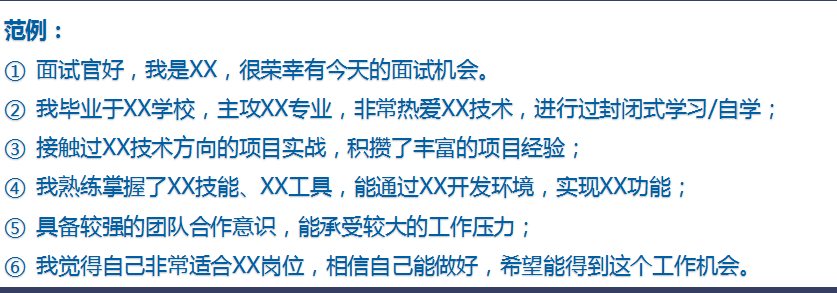
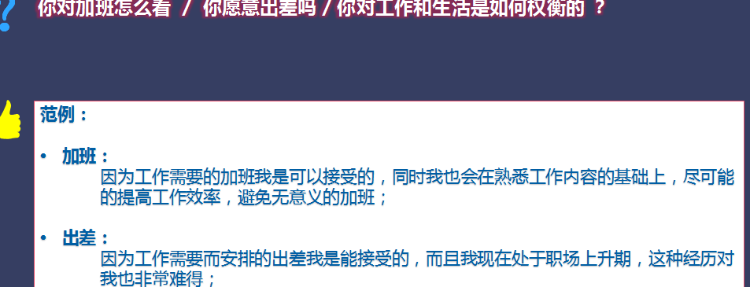
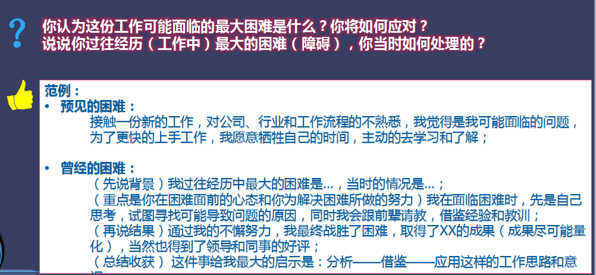
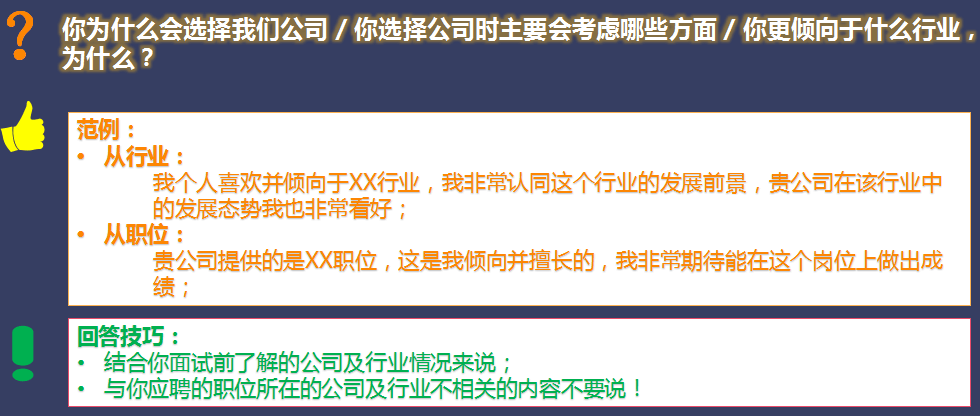
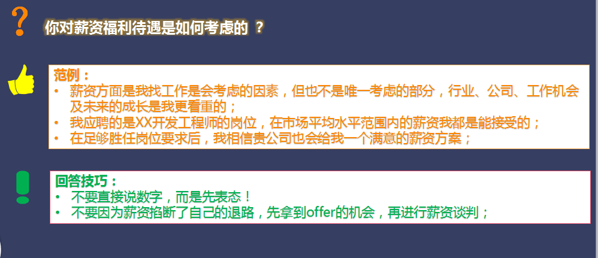

# 面试
##如何成为面试高手
###一、企业选拔人才的流程及方式
电话邀约—>专业测评—>HR初试—>用人部门复试—>入职谈判—>背景调查
###二、全面认识面试
1. 什么是面试
     面试是一种经过组织者精心设计，在特定场景下，以面试官对求职者的面对面交谈与观察为主要手段，由表及里测评求职者的知识、能力、经验、技能等有关素质的考试活动。
2. 面试主要形式
     个体面试，集体面试，视频面试
###三、面试流程
1. 面试前准备：公司情况，职位情况，其他相关信息
2. 面试进行中：应对HR—>做好充足的准备；体现职业化素养；表达技巧和沟通艺术
应对技术经理—>体现专业素养；根据所应聘的职位出发
3. 面试后跟进：面试结束后，询问能得到面试结果的时间及其他有效信息
            索要留心面试官的联系方式
面试结束后，跟面试官保持互动，可主动询问面试结果，做二次争取
###四、面试回答技巧
####胜任类问题：                 
1. 自我介绍                   
2. 谈谈你的上一份工作        
3. 专业知识与学历背景
4. 离职原因
5. 你对加班怎么看，出差怎么看
6. 你认为这份工作面临最大的困难是什么？你将如何应对
####意愿类问题：
1. 公司行业类 为什么选择我们公司？/选择公司主要考虑哪方面？/你倾向什么行业？
2. 职位类 如你希望能接触到哪些具体的工作内容？/什么样的工作能更吸引你？
3. 薪资福利类 你对薪资福利待遇是如何考虑的
4. 职业规划类 你未来3-5年的职业规划是如何考虑的
5. 培训发展晋升类 你希望在工作中接触到哪些具体的培训及培养方案？
###五、如何成为合格的面试官
1. 模拟面试的准备工作：资料准备，场地准备，活动组织
2. 模拟面试操作流程：开场准备；1对1面试+现场观摩；1对1面试点评；当天总评

